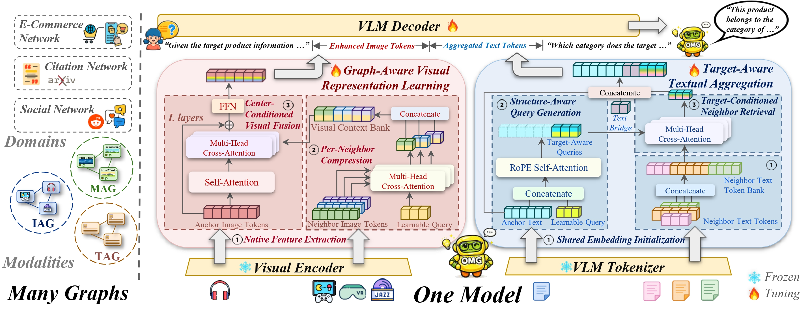

<div align="center">
    
# OMG-VLM

### One Model, Many Graphs: Learning over Attributed Graphs across Heterogeneous Modalities with Vision-Language Models

**EMNLP 2026 Main Conference 採択論文**

Jiayi Yang · Yifang Chen · Yuanfu Sun · Jiajin Liu · Qiaoyu Tan

[](https://arxiv.org/abs/2607.19128)
[](https://github.com/Jo-eyang/OMG-VLM)


[English](../README.md) | [简体中文](README.zh-CN.md) | [日本語](README.ja.md) | [한국어](README.ko.md) | [Español](README.es.md) | [Français](README.fr.md)

<br>

[概要](#概要) · [クイックスタート](#クイックスタート) · [データ形式](#データ形式) · [学習](#学習) · [評価](#評価) · [引用](#引用)

<br>



<p><em>単一の視覚言語バックボーンで、テキスト属性、画像属性、マルチモーダル属性のグラフを統一的に学習します。</em></p>

</div>

## 概要

**OMG-VLM** は、異種モダリティスキーマを持つ属性付きグラフ学習のための統一的な視覚言語フレームワークです。**Qwen-VL** を基盤とし、画像属性とテキスト属性の両方について、近傍構造の情報を VLM ネイティブな埋め込み空間へ注入するグラフ認識アダプタを追加しています。

| 項目 | 説明 |
| --- | --- |
| タスク | 画像、テキスト、または混合ノード属性を持つ属性付きグラフ学習 |
| バックボーン | Qwen-VL / Qwen-VL-Chat スタイルの causal VLM |
| グラフモジュール | グラフ認識ビジュアルアダプタとターゲット認識テキスト集約 |
| 学習方式 | LoRA と DeepSpeed ZeRO-2 に対応した教師ありファインチューニング |

## 主な特徴

- **1つのモデルで多様なグラフに対応:** 共有 VLM バックボーンにより、画像、テキスト、または画像とテキストが混在する属性スキーマのグラフ例を扱えます。
- **グラフ認識ビジュアルアダプタ:** 中心ノードの画像特徴が、Qwen-VL 埋め込み空間内で圧縮された近傍画像特徴にアテンションします。
- **ターゲット認識テキスト集約:** 対象ノードのテキストから近傍テキストを検索し、学習可能なコンテキスト token に圧縮します。
- **再現可能なインターフェース:** 学習と評価は conversation 形式のグラフ例を使用し、近傍ファイルとテキスト属性ファイルを明示的に指定します。


## ファイル構成

<details>
<summary>リポジトリ構成を表示</summary>

```text
OMG-VLM/
|-- README.md
|-- CITATION.cff
|-- NOTICE
|-- QWEN_LICENSE
|-- requirements.txt
|-- ds_config_zero2.json
|-- assets/
|   |-- OMG_figure2.jpg
|   |-- README.zh-CN.md
|   |-- README.ja.md
|   |-- README.ko.md
|   |-- README.es.md
|   `-- README.fr.md
|-- train_omg_vlm.py
|-- evaluate_omg_vlm.py
|-- omg_vlm/
|   |-- __init__.py
|   |-- image.py
|   `-- text.py
`-- Qwen_VL_Chat/
    |-- __init__.py
    |-- config.json
    |-- configuration_qwen.py
    |-- generation_config.json
    |-- modeling_qwen.py
    |-- qwen_generation_utils.py
    |-- qwen.tiktoken
    |-- tokenization_qwen.py
    |-- tokenizer_config.json
    `-- visual.py
```

</details>

主要コンポーネント:

- `omg_vlm/image.py`: `GraphAwareVisualAdapter`、`PerNeighborVisualCompressor`、`CenterConditionedVisualFusionLayer` を含むグラフ認識画像モジュール。
- `omg_vlm/text.py`: テキスト属性から近傍コンテキストを取得するターゲット認識テキスト集約モジュール。
- `Qwen_VL_Chat/`: Qwen-VL バックボーン、tokenizer、生成ユーティリティ、モデル統合コード。
- `train_omg_vlm.py`: 教師ありファインチューニングのエントリポイント。
- `evaluate_omg_vlm.py`: JSONL 予測を出力する評価エントリポイント。
- `ds_config_zero2.json`: 学習スクリプトで使用する DeepSpeed ZeRO-2 設定。
- `assets/`: 図とローカライズ版 README を集約したリポジトリアセット用ディレクトリ。

## クイックスタート

> Python 3.9 以上と CUDA 対応環境を推奨します。

リポジトリをクローンし、独立した環境を作成します。

```bash
git clone https://github.com/Jo-eyang/OMG-VLM.git
cd OMG-VLM
conda create -n omg-vlm python=3.9 -y
conda activate omg-vlm
pip install -r requirements.txt
```

[Qwen-VL-Chat](https://huggingface.co/Qwen/Qwen-VL-Chat) のベース重みは別途ダウンロードし、git リポジトリ外に配置してください。

```text
/path/to/Qwen_VL_Chat
```

[データ形式](#データ形式)に従って conversation、近傍、テキスト属性の JSON ファイルを準備し、[学習](#学習)および[評価](#評価)のコマンドを使用してください。

## データ形式

グラフデータは conversation 形式で用意します。テキストノードは `<text>node_id</text>`、画像ノードは `/path/to/image.jpg</img>` と表します。

conversation 例:

```json
[
  {
    "id": "example_0",
    "dataset_idx": 0,
    "conversations": [
      {
        "from": "user",
        "value": "Classify the node: <text>node_0</text>"
      },
      {
        "from": "assistant",
        "value": "label_name"
      }
    ]
  }
]
```

近傍ファイル:

```json
{
  "node_id": ["neighbor_1", "neighbor_2"]
}
```

テキスト属性ファイル:

```json
{
  "node_id": "raw node text"
}
```

`neighbor_data_path` と `text_info_path` には、カンマ区切りの複数 JSON パスも指定できます。その場合、各例は `dataset_idx` を使って対応するデータセット固有の近傍辞書とテキスト属性辞書を選択できます。

## 学習

教師ありファインチューニングを実行します。

```bash
torchrun --nproc_per_node 8 train_omg_vlm.py \
  --model_name_or_path /path/to/Qwen_VL_Chat \
  --data_path /path/to/train.json \
  --eval_data_path /path/to/valid.json \
  --neighbor_data_path /path/to/neighbors.json \
  --text_info_path /path/to/text_info.json \
  --output_dir outputs/omg_vlm \
  --model_max_length 8192 \
  --use_lora true \
  --train_only_visual_adapter true \
  --visual_adapter_num_layers 1 \
  --use_visual_compressor true \
  --visual_adapter_num_queries 32 \
  --visual_adapter_num_heads 32 \
  --textual_aggregation_context_tokens 16
```

よく使うオプション:

- `--max_neighbors`: 各ノードに注入するグラフ近傍の最大数。
- `--use_lora`: PEFT LoRA ファインチューニングを有効化。
- `--train_only_visual_adapter`: グラフ認識ビジュアルモジュールのみを学習。
- `--use_visual_compressor`: 各近傍画像を学習可能なビジュアル query に圧縮。
- `--textual_aggregation_context_tokens`: テキスト近傍集約で生成する `<nbr>` コンテキスト token 数。

## 評価

予測を生成します。

```bash
python evaluate_omg_vlm.py \
  --model_name_or_path /path/to/Qwen_VL_Chat \
  --adapter_path outputs/omg_vlm \
  --data_path /path/to/test.json \
  --neighbor_data_path /path/to/neighbors.json \
  --text_info_path /path/to/text_info.json \
  --output_path outputs/omg_vlm/test_predictions.jsonl
```

評価スクリプトは、生成された予測、任意の正解、任意の exact-match スコアを含む JSON オブジェクトを例ごとに 1 行ずつ出力します。

## 出力

学習では、グラフ認識モジュールをベース checkpoint とは別に保存します。

```text
outputs/omg_vlm/
|-- visual_adapter.pth
|-- textual_aggregation.pth
`-- ...
```

LoRA を有効にした場合、Hugging Face/PEFT の学習ユーティリティにより LoRA adapter も同じ出力ディレクトリに保存されます。

## 引用

OMG-VLM が研究に役立つ場合は、以下の論文を引用してください。

```bibtex
@inproceedings{yang2026one,
  title={One Model, Many Graphs: Learning over Attributed Graphs across Heterogeneous Modalities with Vision-Language Models},
  author={Yang, Jiayi and Chen, Yifang and Sun, Yuanfu and Liu, Jiajin and Tan, Qiaoyu},
  booktitle={Proceedings of the 2026 Conference on Empirical Methods in Natural Language Processing},
  year={2026}
}
```

## 謝辞

本コードベースは Qwen-VL と、VLM/LLM エコシステムで広く使われているオープンソースツールを基盤としています。Qwen-VL、Hugging Face Transformers、PEFT、FastChat、DeepSpeed、および関連プロジェクトの作者とメンテナーに感謝します。
